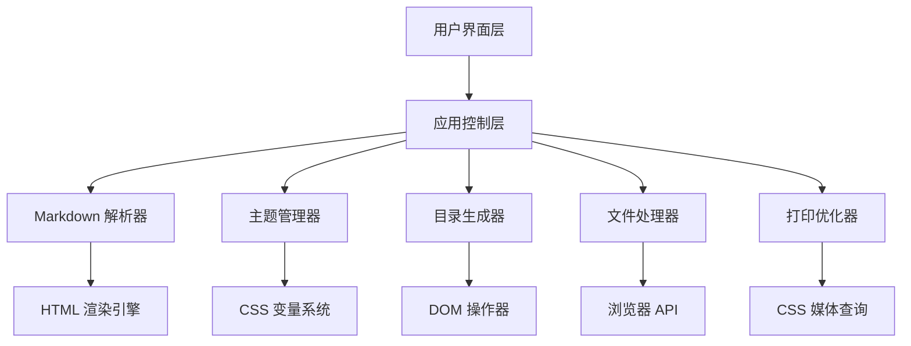

# Design Document

## Overview

Markdown 转 HTML 转换器是一个纯前端单页应用，使用现代 Web 技术栈构建。系统采用模块化架构，包含 Markdown 解析、主题管理、目录生成、文件处理和打印优化等核心功能模块。

## Architecture

### 系统架构图



### 技术栈选择

- **前端框架**: Vanilla JavaScript (ES6+) 或 Vue.js 3
- **Markdown 解析**: marked.js 或 markdown-it
- **CSS 框架**: 自定义 CSS 变量系统
- **代码高亮**: Prism.js 或 highlight.js
- **构建工具**: Vite
- **包管理**: npm

## Components and Interfaces

### 1. MarkdownConverter 组件

**职责**: 核心 Markdown 解析和 HTML 生成

```typescript
interface MarkdownConverter {
  parseMarkdown(content: string): string;
  generateHTML(parsedContent: string, options: ConversionOptions): string;
  validateMarkdown(content: string): ValidationResult;
}

interface ConversionOptions {
  theme: 'light' | 'dark' | 'auto';
  includeTableOfContents: boolean;
  enableCodeHighlight: boolean;
  optimizeForPrint: boolean;
}
```

### 2. ThemeManager 组件

**职责**: 主题切换和系统主题检测

```typescript
interface ThemeManager {
  getCurrentTheme(): Theme;
  setTheme(theme: Theme): void;
  detectSystemTheme(): Theme;
  subscribeToSystemThemeChange(callback: (theme: Theme) => void): void;
}

type Theme = 'light' | 'dark' | 'auto';
```

### 3. TOCGenerator 组件

**职责**: 目录生成和导航功能

```typescript
interface TOCGenerator {
  generateTOC(htmlContent: string): TOCItem[];
  renderTOC(tocItems: TOCItem[]): HTMLElement;
  setupScrollSpy(tocItems: TOCItem[]): void;
}

interface TOCItem {
  id: string;
  text: string;
  level: number;
  children: TOCItem[];
}
```

### 4. FileHandler 组件

**职责**: 文件上传、验证和下载

```typescript
interface FileHandler {
  handleFileUpload(file: File): Promise<string>;
  validateFile(file: File): ValidationResult;
  downloadHTML(content: string, filename: string): void;
  generateFilename(markdownContent: string): string;
}

interface ValidationResult {
  isValid: boolean;
  errors: string[];
}
```

### 5. PrintOptimizer 组件

**职责**: 打印样式优化

```typescript
interface PrintOptimizer {
  generatePrintCSS(): string;
  optimizeForPrint(htmlContent: string): string;
  handlePageBreaks(content: string): string;
}
```

## Data Models

### 应用状态模型

```typescript
interface AppState {
  markdownContent: string;
  htmlContent: string;
  currentTheme: Theme;
  tocItems: TOCItem[];
  isPreviewMode: boolean;
  fileName: string;
}
```

### 配置模型

```typescript
interface AppConfig {
  defaultTheme: Theme;
  enableAutoSave: boolean;
  maxFileSize: number;
  supportedFileTypes: string[];
  printSettings: PrintSettings;
}

interface PrintSettings {
  pageSize: 'A4' | 'Letter';
  margin: string;
  fontSize: string;
  lineHeight: number;
}
```

## Error Handling

### 错误类型定义

```typescript
enum ErrorType {
  FILE_UPLOAD_ERROR = 'FILE_UPLOAD_ERROR',
  MARKDOWN_PARSE_ERROR = 'MARKDOWN_PARSE_ERROR',
  THEME_LOAD_ERROR = 'THEME_LOAD_ERROR',
  DOWNLOAD_ERROR = 'DOWNLOAD_ERROR'
}

interface AppError {
  type: ErrorType;
  message: string;
  details?: any;
  timestamp: Date;
}
```

### 错误处理策略

1. **文件上传错误**: 显示用户友好的错误消息，支持重试
2. **Markdown 解析错误**: 高亮错误位置，提供修复建议
3. **主题加载错误**: 回退到默认主题，记录错误日志
4. **下载错误**: 提供替代下载方式，如复制到剪贴板

## User Interface Design

### 布局结构

```
┌─────────────────────────────────────────┐
│              Header                      │
│  [Logo] [Theme Toggle] [Download]       │
├─────────────────────────────────────────┤
│                                         │
│  ┌─────────────┐  ┌─────────────────┐   │
│  │             │  │                 │   │
│  │   Input     │  │    Preview      │   │
│  │   Panel     │  │    Panel        │   │
│  │             │  │                 │   │
│  │ [File Upload│  │ [TOC] [Content] │   │
│  │  Text Area] │  │                 │   │
│  └─────────────┘  └─────────────────┘   │
│                                         │
├─────────────────────────────────────────┤
│              Footer                      │
│         [Status] [Help]                 │
└─────────────────────────────────────────┘
```

### 响应式断点

- **桌面**: >= 1024px (双栏布局)
- **平板**: 768px - 1023px (可折叠侧边栏)
- **手机**: < 768px (单栏布局，标签切换)

## Testing Strategy

### 单元测试

- **MarkdownConverter**: 测试各种 Markdown 语法解析
- **ThemeManager**: 测试主题切换和系统主题检测
- **TOCGenerator**: 测试目录生成和导航功能
- **FileHandler**: 测试文件上传验证和下载功能

### 集成测试

- 端到端工作流测试：上传文件 → 转换 → 下载
- 主题切换在不同组件间的一致性测试
- 响应式布局在不同屏幕尺寸下的测试

### 浏览器兼容性测试

- Chrome (最新版本)
- Firefox (最新版本)
- Safari (最新版本)
- Edge (最新版本)

## Performance Considerations

### 优化策略

1. **懒加载**: 大文件内容分块处理
2. **防抖**: 输入时延迟解析，避免频繁更新
3. **缓存**: 缓存解析结果和主题设置
4. **代码分割**: 按需加载代码高亮库
5. **压缩**: 生成的 HTML 文件压缩优化

### 性能指标

- 首次内容绘制 (FCP): < 1.5s
- 最大内容绘制 (LCP): < 2.5s
- 首次输入延迟 (FID): < 100ms
- 累积布局偏移 (CLS): < 0.1

## Security Considerations

1. **XSS 防护**: 对用户输入进行 HTML 转义
2. **文件验证**: 严格验证上传文件类型和大小
3. **CSP 策略**: 实施内容安全策略
4. **依赖安全**: 定期更新依赖库，扫描安全漏洞